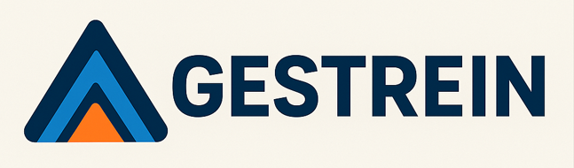

# Gerenciamento de Treinamentos  

## ✔️ Apresentação  
O **Sistema de Gestão de Treinamentos** é uma plataforma web desenvolvida para **modernizar e centralizar** o gerenciamento de treinamentos corporativos.  

Seu propósito é substituir processos manuais e descentralizados — geralmente baseados em planilhas — por um sistema **moderno, responsivo, intuitivo e seguro**, que reúne todas as informações em um único ambiente digital.  

A solução oferece **confiabilidade nos registros**, maior **eficiência operacional** e suporte para **decisões estratégicas**, permitindo que as empresas planejem, acompanhem e avaliem treinamentos de forma ágil e integrada.  

### ✔️ Principais propósitos do sistema:  
- Centralizar informações de treinamentos, instrutores e colaboradores.  
- Automatizar alertas de prazos e vencimentos de treinamentos.  
- Disponibilizar relatórios gerenciais e estratégicos.  
- Garantir usabilidade em **desktop, tablets e dispositivos móveis**.  
- Aumentar a eficiência no **cumprimento de prazos** e na gestão das demandas.  

